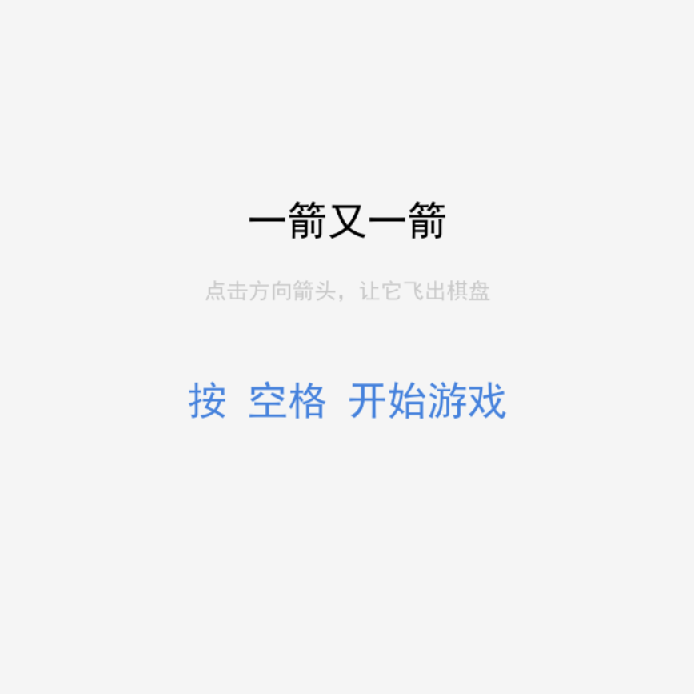
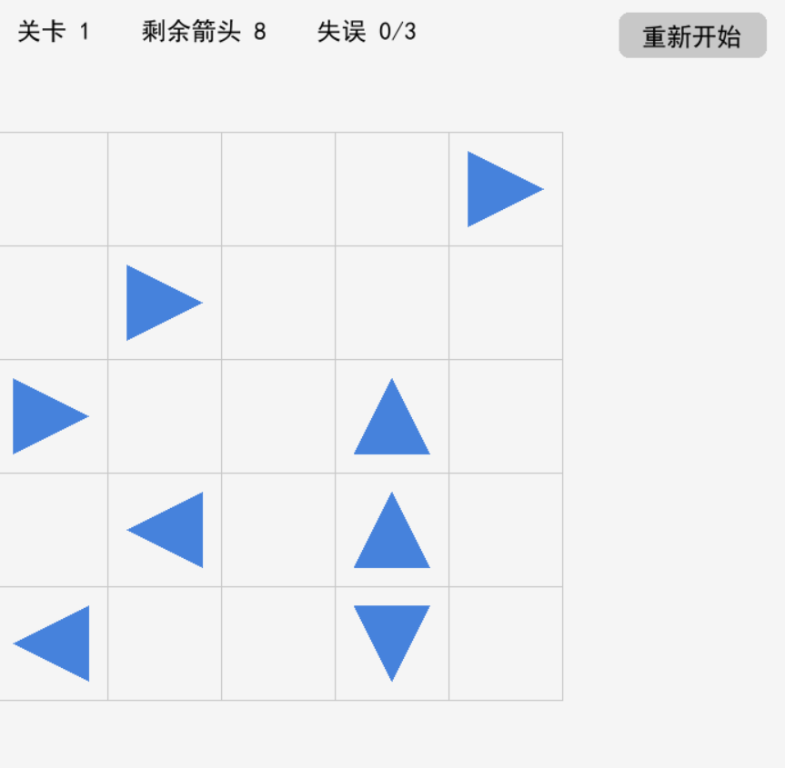
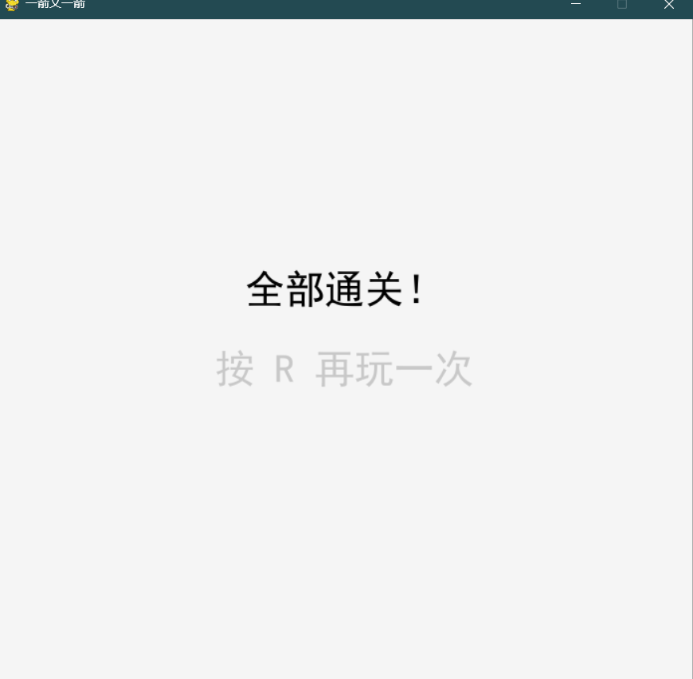

# 一箭又一箭（Arrow Escape）

## 项目简介

“一箭又一箭”是一款基于 Python + Pygame 开发的点击式解谜小游戏。棋盘中分布着朝**上、下、左、右**四个方向的箭头，玩家需要观察箭头之间的阻挡关系，按正确顺序点击，让所有箭头依次飞出棋盘。若点击的箭头前方（沿它朝向到棋盘边界）还有其他箭头阻挡，则该箭头无法飞出并消耗一次失误机会。清空所有箭头即通关，失误次数耗尽则失败。

本项目为福州大学 2026 秋《软件工程》课程第二次个人作业，开发过程中使用了 AIGC 工具辅助学习与调试。

## 开发环境

- 操作系统：Windows 11
- Python：3.11.9
- Pygame：2.6.1
- 代码编辑器：VS Code
- 版本管理：Git + GitHub

## 安装与运行

### 1. 安装依赖

确保已安装 Python 3.8 及以上版本，然后在命令行中执行：

```bash
pip install pygame
```

### 2. 获取代码

```bash
git clone https://github.com/uzk20
cd homework2
```

### 3. 运行游戏

```bash
python main.py
```

## 游戏操作说明

| 操作 | 说明 |
|---|---|
| 空格 | 在开始界面按下，开始游戏；在通关界面按下，进入下一关 |
| 鼠标左键 | 点击箭头，尝试让它飞出棋盘 |
| 鼠标左键 | 点击「重新开始」按钮，将当前关卡恢复到初始状态 |
| R | 在失败或全部通关界面按下，重新开始游戏 |
| 关闭窗口 | 退出游戏 |

### 游戏规则

1. 点击一个箭头后，程序检查它**沿自身方向到棋盘边界**之间是否存在其他箭头。
2. 若前方无阻挡，箭头飞出棋盘并消失。
3. 若前方有箭头，该箭头会**变红并晃动**提示碰撞，同时**失误次数 +1**。
4. 每关失误次数上限为 **3 次**，耗尽即失败。
5. 清空当前关卡所有箭头后，进入下一关。

## 项目结构

```
homework2/
├── main.py          # 程序入口，游戏主循环、界面绘制、状态管理
├── game_logic.py    # 纯逻辑模块：方向定义、关卡解析、路径检测
├── levels.py        # 关卡数据（共 3 关）
├── README.md        # 项目说明
└── screenshots/     # 游戏截图
    ├── start.png
    ├── playing.png
    └── result.png
```

**设计说明**：`game_logic.py` 不依赖 Pygame，可以单独运行或测试路径检测逻辑，做到了游戏逻辑与界面渲染的分离。

## 游戏截图

### 开始界面



### 游戏进行中



### 通关 / 失败界面




## 实现思路

### 1. 箭头与方向的表示

用字符 `U / D / L / R` 表示上、下、左、右四个方向，用 `(行, 列)` 元组表示箭头位置。整个棋盘用一个字典存储：

```python
arrows = {
    (0, 4): "R",
    (1, 1): "R",
    (1, 4): "D",
    ...
}
```

方向到行列增量的映射：

```python
DIRECTION_DELTA = {
    "U": (-1, 0),   # 上：行号减 1
    "D": (1, 0),    # 下：行号加 1
    "L": (0, -1),   # 左：列号减 1
    "R": (0, 1),    # 右：列号加 1
}
```

### 2. 关卡数据

关卡直接写成字符串元组，`.` 表示空格，其余字符表示箭头方向。这样在纸上画好关卡后可以直接誊写进代码：

```python
LEVELS = [
    (
        "....R",
        ".R..D",
        "R..UD",
        ".L.U.",
        "L..D.",
    ),
    # ...更多关卡
]
```

### 3. 路径检测

这是游戏的核心逻辑。从被点击箭头的位置出发，沿它的方向**逐格前进**，直到走出棋盘边界；若途中遇到任何其他箭头，则说明被阻挡：

```python
def can_fly(arrows, row, col, rows, cols):
    direction = arrows[(row, col)]
    dr, dc = DIRECTION_DELTA[direction]
    r, c = row + dr, col + dc

    while 0 <= r < rows and 0 <= c < cols:
        if (r, c) in arrows:
            return False        # 前方有阻挡
        r += dr
        c += dc

    return True                 # 前方畅通
```

### 4. 状态管理

游戏使用一个 `state` 变量管理界面状态，包括 `start`、`playing`、`success`、`failed`、`all_clear`，主循环根据当前状态绘制不同界面。

### 5. 动画与反馈

- **飞出动画**：箭头被消除后不立即消失，而是加入 `animations` 列表，每帧沿自身方向偏移若干像素，持续若干帧后再从列表中移除，实现平移动画。
- **碰撞反馈**：被阻挡的箭头变红并左右晃动，晃动通过 `sin` 函数随时间改变水平偏移实现。

## 关卡设计说明

本项目共设计 3 个关卡，每关均经过实际试玩验证，存在合理的通关顺序。关卡难度循序渐进：

- **第 1 关**：以单方向箭头为主，引导玩家理解基本规则。
- **第 2 关**：混合四个方向的箭头，需要更仔细地观察阻挡关系。
- **第 3 关**：箭头分布更密集，需要规划先后顺序。

## AIGC 使用说明

开发过程中使用了 AIGC 工具辅助完成以下工作（详见课程博客）：

| 子任务 | 使用的工具 | AI 提供的帮助 | 人工修改 |
|---|---|---|---|
| 路径检测 | ChatGPT | 生成四方向路径检测代码 | 修复上/下方向边界判断错误 |
| 游戏结构 | ChatGPT | 建议逻辑与界面分离 | 拆分为多个模块文件 |
| 动画反馈 | ChatGPT | 提供平移与晃动动画思路 | 修复方向旋转角度错误 |
| 调试 | ChatGPT | 帮助定位死循环、方向绘制颠倒等问题 | 逐项验证并修改 |

## 测试结果

| 编号 | 测试内容 | 预期结果 | 实际结果 | 是否通过 |
|---|---|---|---|---|
| T01 | 点击前方无阻挡的箭头 | 箭头飞出棋盘并消失 | 一致 | ✅ |
| T02 | 点击前方有阻挡的箭头 | 箭头不消失，失误次数减 1 | 一致 | ✅ |
| T03 | 点击位于边缘且朝向棋盘外的箭头 | 箭头正常消失，不发生越界错误 | 一致 | ✅ |
| T04 | 消除本关全部箭头 | 显示通关并进入下一关 | 一致 | ✅ |
| T05 | 失误次数耗尽 | 显示失败并允许重新开始 | 一致 | ✅ |
| T06 | 游戏进行中重新开始 | 箭头布局和失误次数恢复 | 一致 | ✅ |

## 已知问题与改进方向

- 目前关卡为固定设计，尚未实现随机生成可通关关卡。
- 飞出动画较为简单，未加入音效。
- 后续可考虑加入提示、撤销、计分等扩展功能。

## 参考

- Pygame 官方文档：https://www.pygame.org/docs/
- 课程作业要求：福州大学 2026 秋软件工程个人作业（第二次）

---
